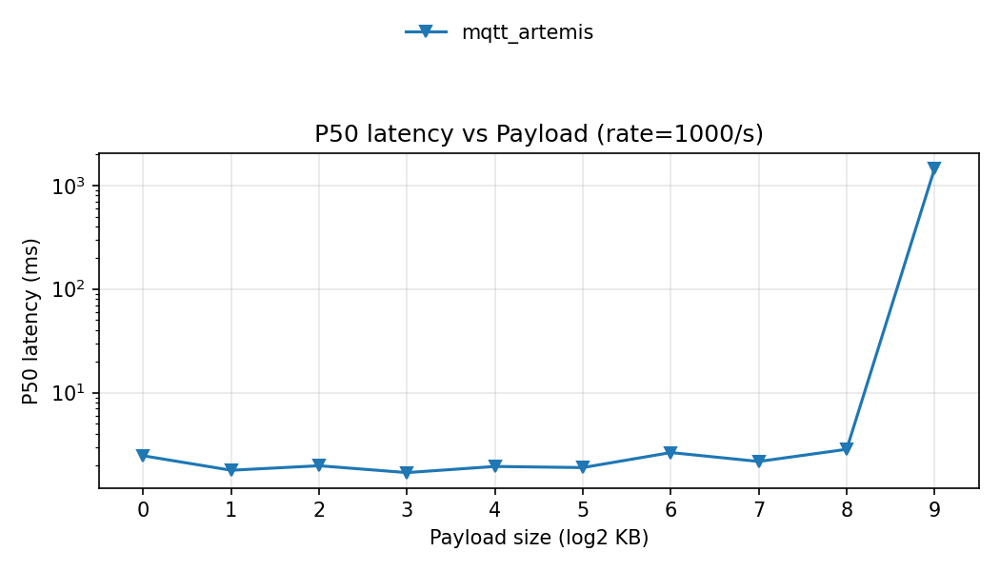
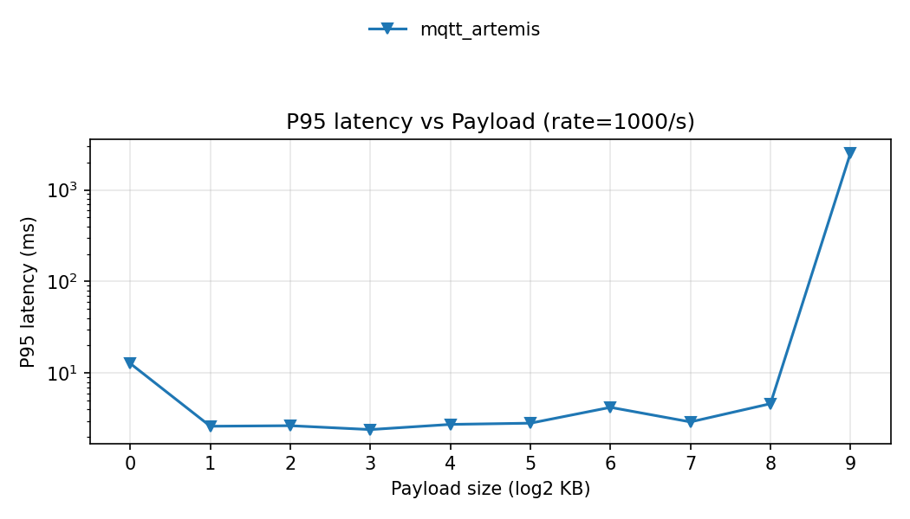
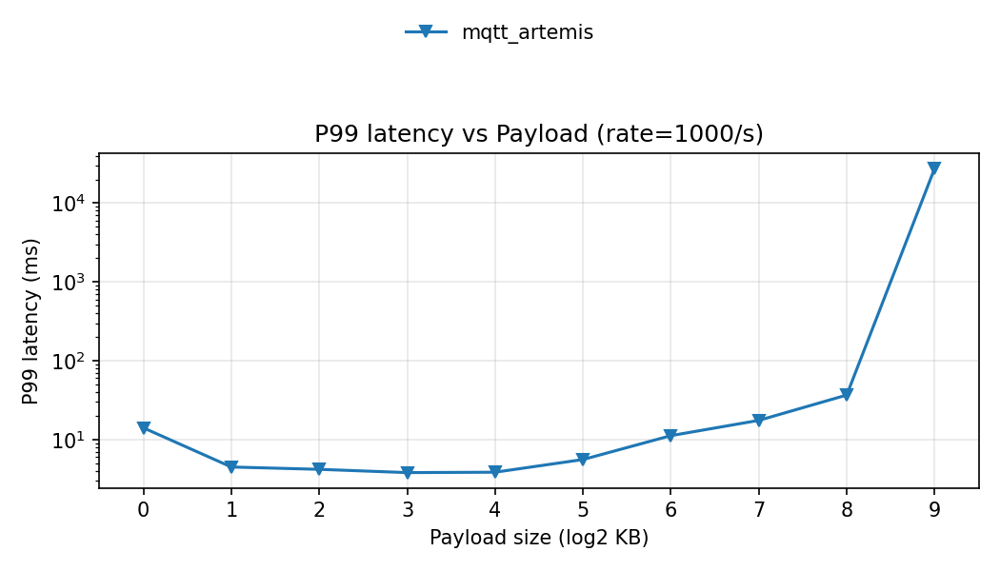

# Benchmark plots

- Summary: `/home/cc/mq-bench/results/latency_vs_payload_20251130_223226/raw_data/summary.csv`

## Table of contents

## Latency vs Payload

### P50 latency

#### rate=1000/s

### P95 latency

#### rate=1000/s

### P99 latency

#### rate=1000/s

