# Benchmark plots

- Summary: `/home/cc/mq-bench/results/latency_vs_payload_20251107_002818/raw_data/summary.csv`

## Table of contents

- [Throughput vs Offered Rate](#throughput-vs-offered-rate)
- [P99 latency vs Offered Rate](#p99-latency-vs-offered-rate)
- [Max CPU% vs Offered Rate](#max-cpu-vs-offered-rate)
- [Max Memory% vs Offered Rate](#max-memory-vs-offered-rate)

## Throughput vs Offered Rate

### payload=1024B

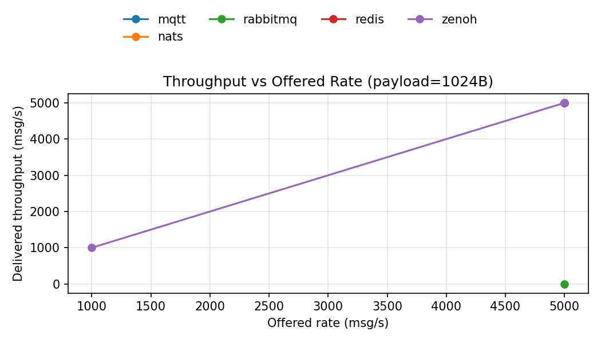

### payload=10240B

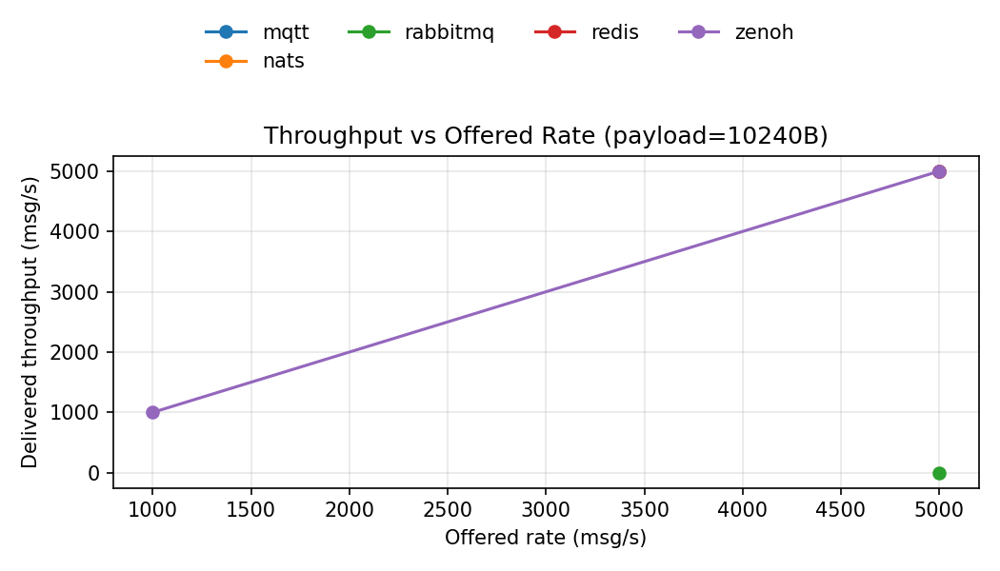

### payload=102400B

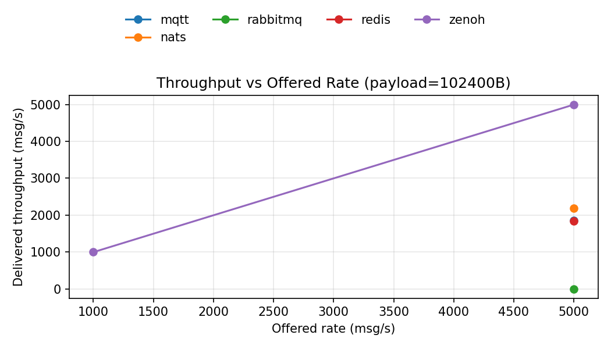

### payload=512000B

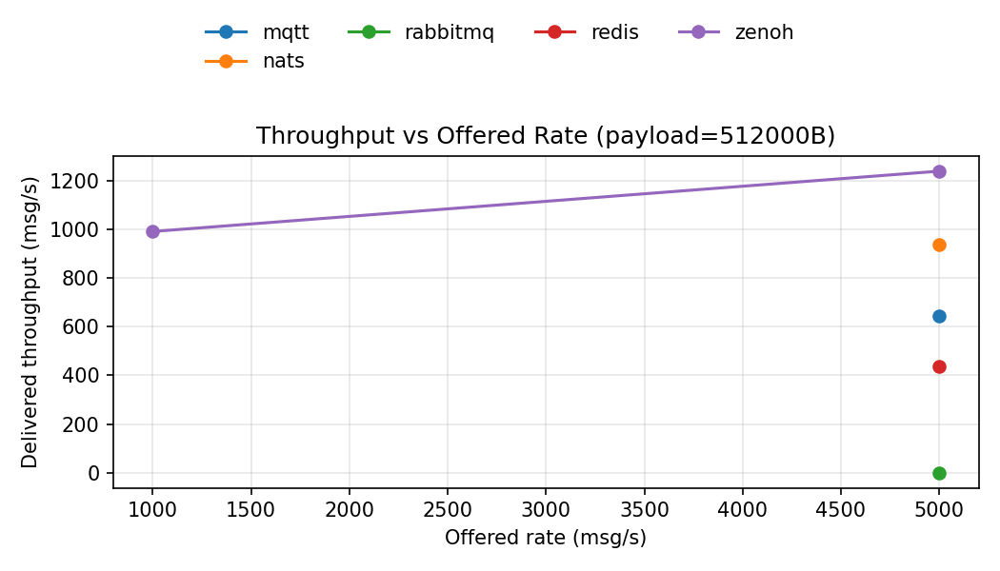

### payload=1048576B

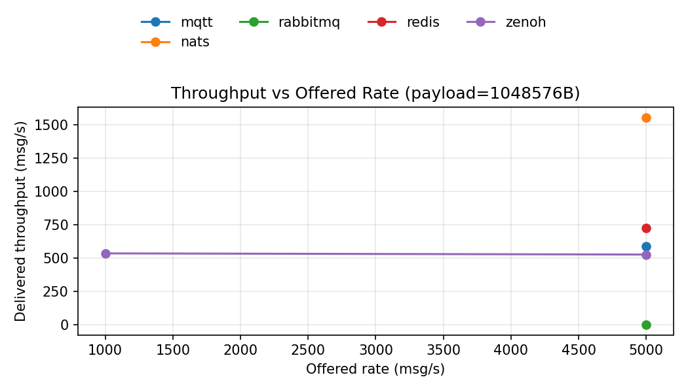

## P99 latency vs Offered Rate

### payload=1024B

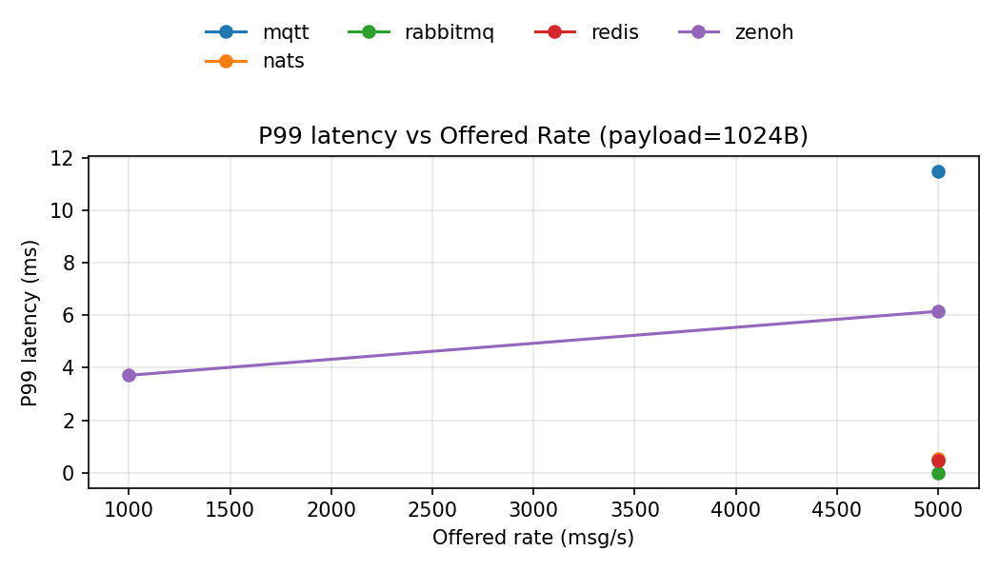

### payload=10240B

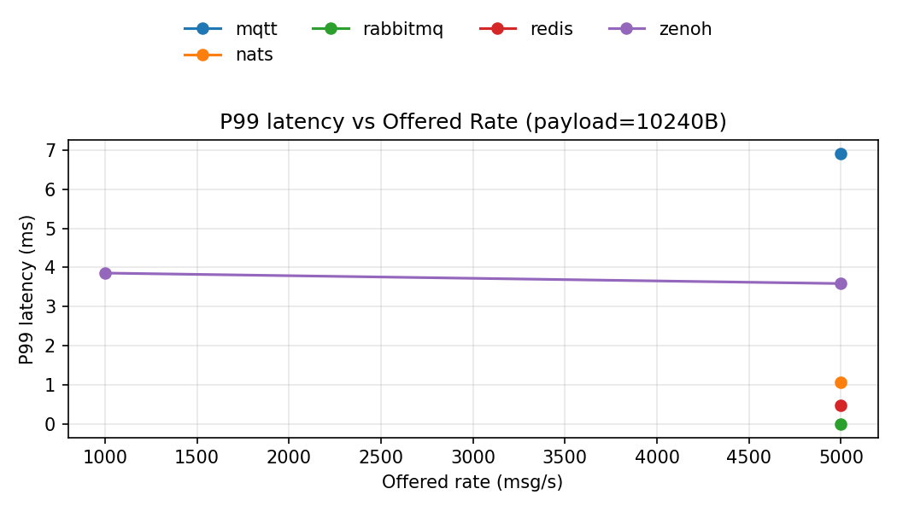

### payload=102400B

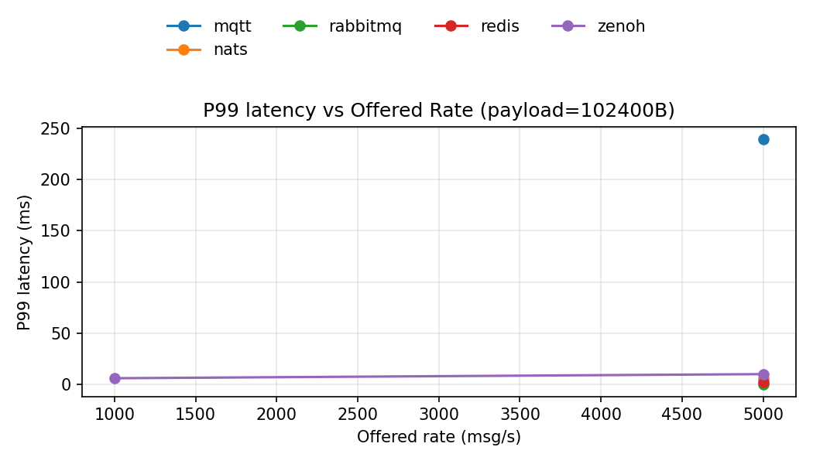

### payload=512000B

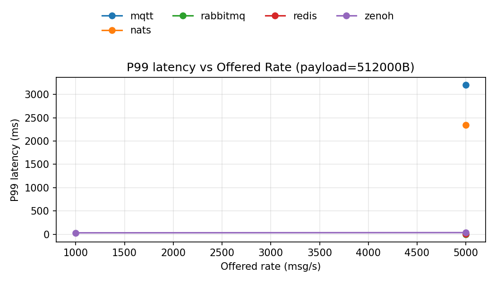

### payload=1048576B

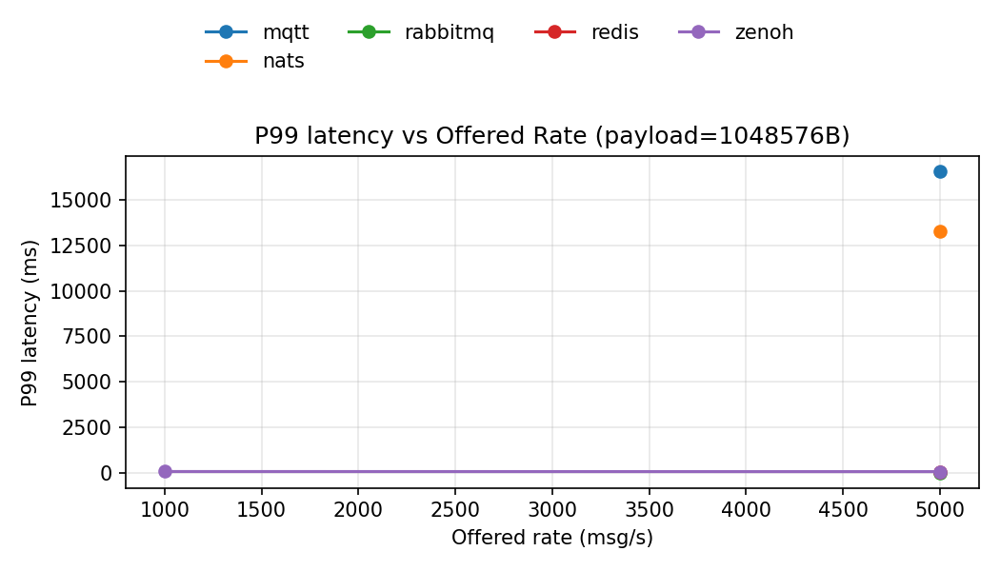

## Max CPU% vs Offered Rate

### payload=1024B

### payload=10240B

### payload=102400B

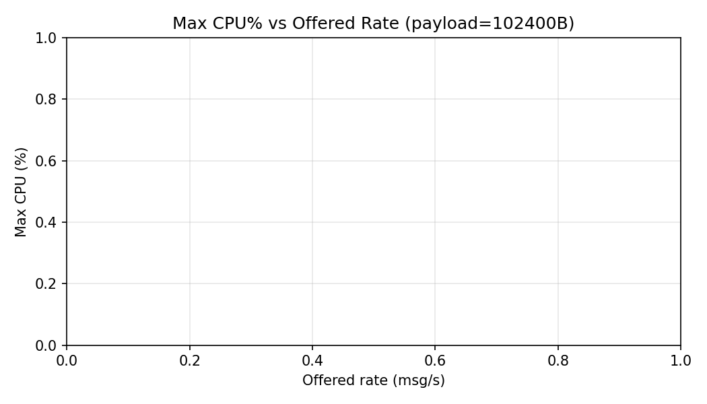

### payload=512000B

### payload=1048576B

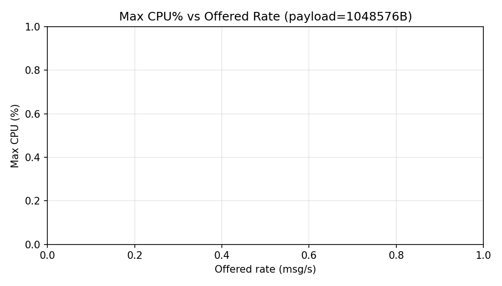

## Max Memory% vs Offered Rate

### payload=1024B

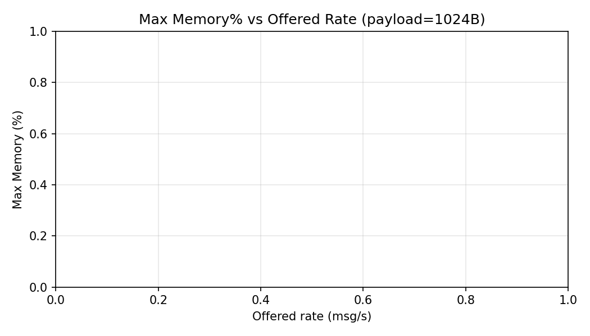

### payload=10240B

### payload=102400B

### payload=512000B

### payload=1048576B

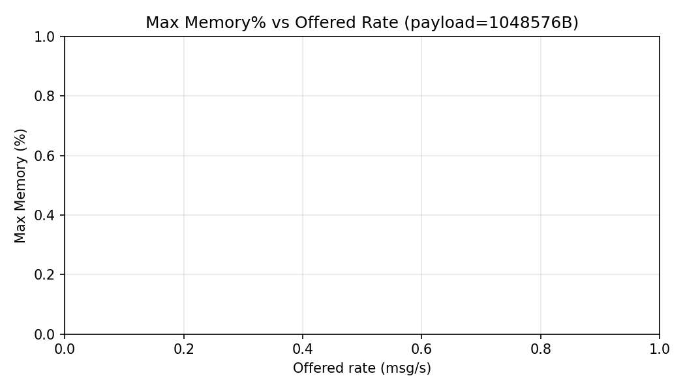

## Latency vs Payload

### P50 latency

#### rate=1000/s

#### rate=5000/s

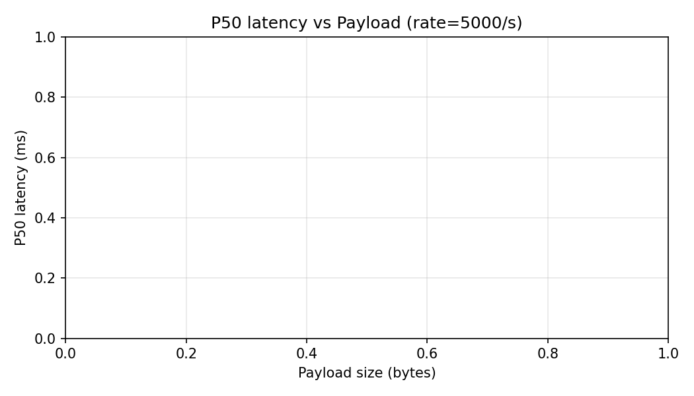

### P95 latency

#### rate=1000/s

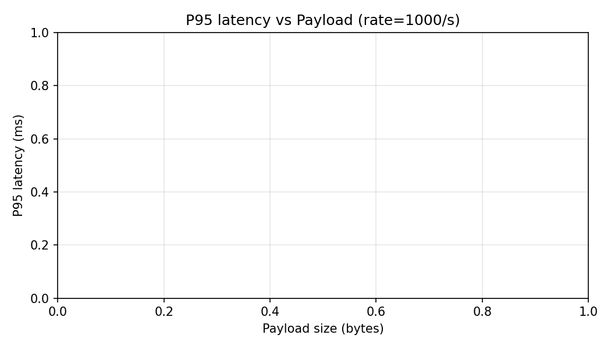

#### rate=5000/s

### P99 latency

#### rate=1000/s

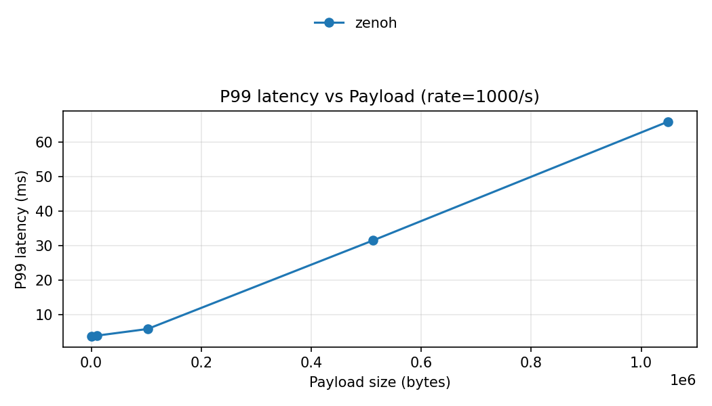

#### rate=5000/s

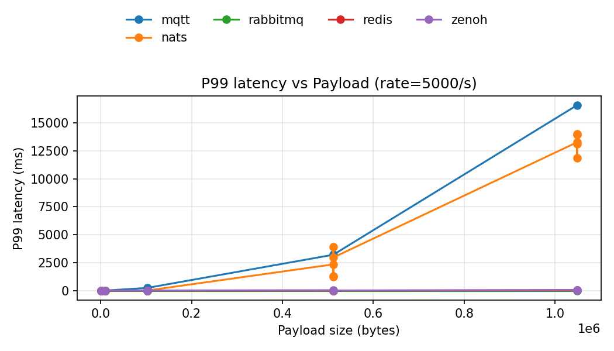

